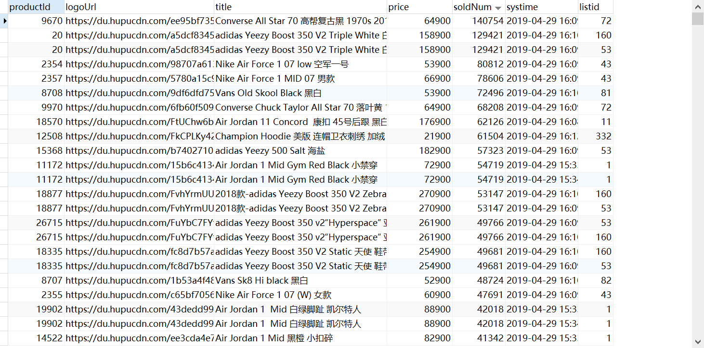
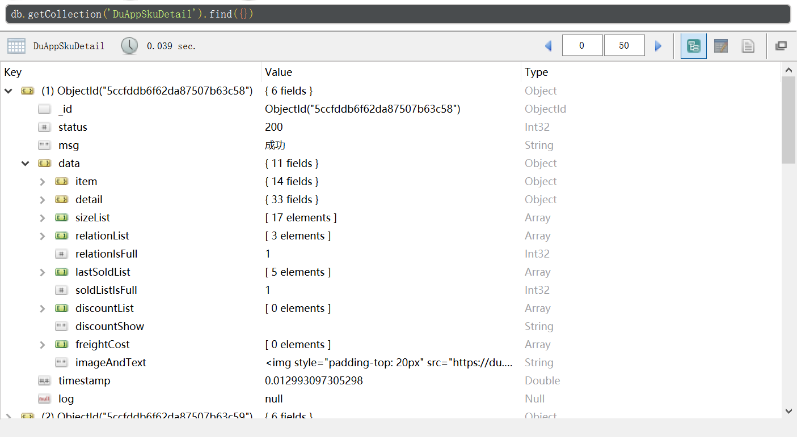

# 毒app的sign加签破解

**逆向js破解毒sign参数，抓取毒app品牌列表页数据，毒app商品详情页数据，最近购买数据，搜索商品数据**<br>

**三种方法分别为：**
- 1.使用python强转js函数为python函数 ；
- 2.js2py执行生成sign的js逻辑函数 ；
- 3.pyexejs执行生成sign的js逻辑函数；

**使用教程：**
【使用请参考本教程】
- X前两个api来自于pc端js逆向，后面一个api来自于微信小程序的js逆向，<br>
  所以构造请求的时候请注意headers的构造！！！最近购买的请求头特别要注意！
- √目前接口均来自小程序，headers均使用下面代码示例即可请求成功
- sign的密匙列表：
  - 关键词搜索商品接口
      - √(最新sign构造)'limit20page{}sortMode{}sortType{}titleajunionId19bc545a393a25177083d4a748807cc0'.format(page, sortMode, sortType)
      - (最新url)'https://app.poizon.com/api/v1/h5/product/fire/search/list?title=aj&page={}&sortType={}&sortMode={}&' \
                             'limit=20&unionId=&sign={}'.format(page, sortType,sortMode, sign)
      - page如1为翻页参数，sortType如1为排序方式，sortMode如0
  - 品牌系列列表页api的sign密匙构造：
      -  X(废弃)'lastId{}recommendId{}048a9c4943398714b356a696503d2d36'.format(page, brand_id)
      -  X(废弃) https://m.poizon.com/mapi/product/recommendDetail?recommendId={}&lastId={}&sign={}
      -  √(最新sign构造) 'lastId{}limit20tabId{}19bc545a393a25177083d4a748807cc0'.format(lastId, tabId)
      -  √(最新url) https://app.poizon.com/api/v1/h5/index/fire/shoppingTab?tabId={}&limit=20&lastId={}&sign={}
      -  tabId 如 4 为球鞋品类, lastId 如 1 为翻页参数
  - 商品详细数据页api的sign密匙构造：   
      -  X(废弃) 'productId{}sourceshareDetail048a9c4943398714b356a696503d2d36'.format(product_id)
      -  X(废弃) https://m.poizon.com/mapi/product/detail?productId={}&source=shareDetail&sign={}
      -  √(最新sign构造) 'productId{}productSourceNamewx19bc545a393a25177083d4a748807cc0'.format(productId)
      -  √(最新url) https://app.poizon.com/api/v1/h5/index/fire/flow/product/detail?productId={}&productSourceName=wx&sign={}
   - 商品最近购买记录页api的sign密匙构造：
      - 'lastId{}limit20productId{}sourceAppapp19bc545a393a25177083d4a748807cc0'.format(lastId, productId)
      - https://app.poizon.com/api/v1/h5/product/fire/recentSoldList?productId={}&lastId={}&limit=20&sourceApp=app&sign={}
    
   - 后期计划加入搜索接口，scrapy-redis分布式 
 ### pyexejs代码例子
 ``` 
import execjs
import requests
headers = {
    'Host': "app.poizon.com",
    'User-Agent': "Mozilla/5.0 (Windows NT 6.1; WOW64) AppleWebKit/537.36 (KHTML, like Gecko)"
    " Chrome/53.0.2785.143 Safari/537.36 MicroMessenger/7.0.4.501 NetType/WIFI "
    "MiniProgramEnv/Windows WindowsWechat",
    'appid': "wxapp",
    'appversion': "4.4.0",
    'content-type': "application/x-www-form-urlencoded",
    'Accept-Encoding': "gzip, deflate",
    'Accept': "*/*",
 }
 
def get_recensales_list_url(lastId, productId):
    # 最近购买接口
    with open('sign.js', 'r', encoding='utf-8')as f:
        all_ = f.read()
        ctx = execjs.compile(all_)
        sign = ctx.call('getSign','lastId{}limit20productId{}sourceAppapp19bc545a393a25177083d4a748807cc0'.format(lastId,productId))
        recensales_list_url = 'https://app.poizon.com/api/v1/h5/product/fire/recentSoldList?' \
                              'productId={}&lastId={}&limit=20&sourceApp=app&sign={}'.format(productId, lastId, sign)
        return recensales_list_url
        
def get_search_by_keywords_url(page, sortMode, sortType):
    # 关键词搜索商品接口
    with open('sign.js', 'r', encoding='utf-8')as f:
        all_ = f.read()
        ctx = execjs.compile(all_)
        # 53489
        sign = ctx.call('getSign','limit20page{}sortMode{}sortType{}titleajunionId19bc545a393a25177083d4a748807cc0'.format(page,                            sortMode, sortType))
        search_by_keywords_url = 'https://app.poizon.com/api/v1/h5/product/fire/search/list?title=aj&page={}&sortType={}&sortMode={}&' \
                             'limit=20&unionId=&sign={}'.format(page, sortType,sortMode, sign)
        return search_by_keywords_url
        
def get_brand_list_url(lastId, tabId):
    # 商品品类列表接口
    with open('sign.js', 'r', encoding='utf-8')as f:
        all_ = f.read()
        ctx = execjs.compile(all_)
        sign = ctx.call('getSign',
                        'lastId{}limit20tabId{}19bc545a393a25177083d4a748807cc0'.format(lastId, tabId))
        brand_list_url = 'https://app.poizon.com/api/v1/h5/index/fire/shoppingTab?' \
                             'tabId={}&limit=20&lastId={}&sign={}'.format(tabId, lastId, sign)
        return brand_list_url
        
def get_product_detail_url(productId):
    # 商品详情接口
    with open('sign.js', 'r', encoding='utf-8')as f:
        all_ = f.read()
        ctx = execjs.compile(all_)
        sign = ctx.call('getSign',
                        'productId{}productSourceNamewx19bc545a393a25177083d4a748807cc0'.format(
                                                                                                        productId))
        product_detail_url = 'https://app.poizon.com/api/v1/h5/index/fire/flow/product/detail?' \
                              'productId={}&productSourceName=wx&sign={}'.format(productId, sign)
        return product_detail_url   
        
recensales_list_url = get_recensales_list_url(0, 40755)
search_by_keywords_url = get_search_by_keywords_url(0, 1, 0)
brand_list_url = get_brand_list_url(1, 4)
product_detail_url =  get_product_detail_url(53489)
recensales_list_response = requests.get(url=recensales_list_url, headers=headers)
search_by_keywords_response =  requests.get(url=search_by_keywords_url, headers=headers)
brand_list_response = requests.get(url=brand_list_url, headers=headers)
product_detail_response = requests.get(url=product_detail_url, headers=headers)
print(recensales_list_response.text)
print(search_by_keywords_response.text)
print(brand_list_response.text)
print(product_detail_response.text)
# 这四个api基本涵盖毒app的核心数据api
```
**交流：https://t.me/joinchat/M3PE4RbHgrZJKhMIgQLwoQ**<br>
<!-- <br> -->
    
## 结果
 **词云**
 
 
 **商品**
 
 
 **商品详情**
 
>**（本项目仅用于学习用途，使用本项目的一切后果自负，如果毒app看到本项目觉得需要删除请联系邮箱）**。
<br>
 **请我喝杯咖啡，维护不易**<br>
 
